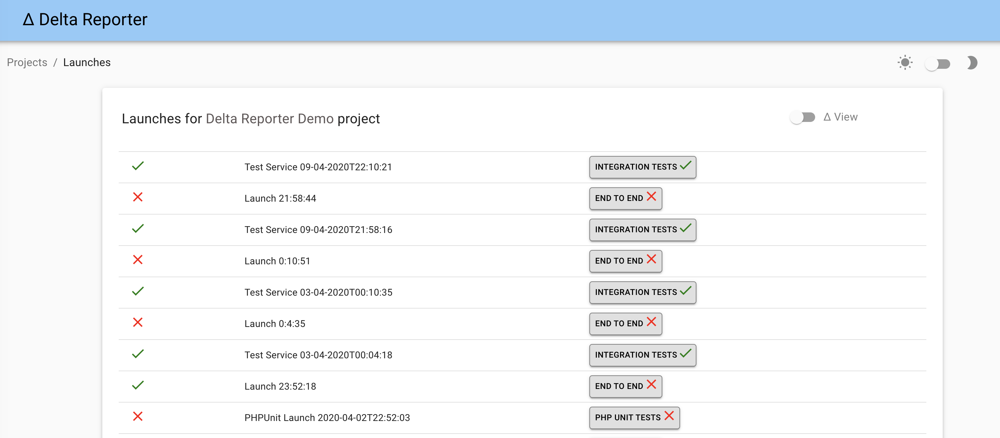
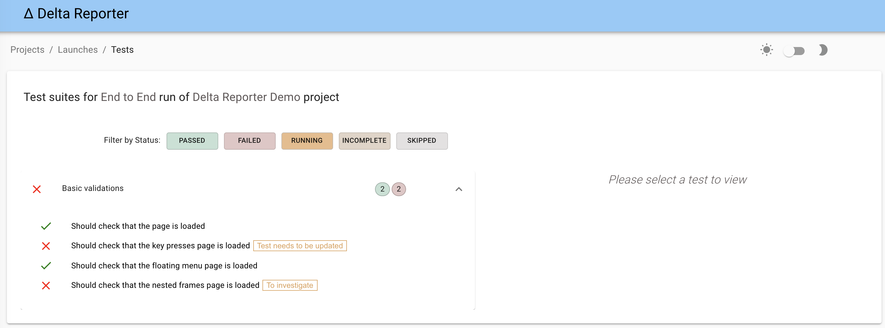
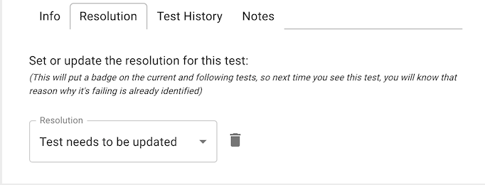

# Report structure and main features

Delta Reporter tool has some great features available to you, please read the following guide if you want to know more!

## Structure Overview

There are few main components that form the report, it's quite intuitive and easy to understand and follow.

#### Projects

Main page of the tool is the projects page. 
This page contains all the different projects your teams are working on, so that tests are nicely structured and easy to find.

#### Launches

After the project is selected, user is navigated to Launches page. 
This page contains all the test runs. Say, there was a release, and some UI tests were triggered by CI job. 
There will be a new launch created with your UI tests available there.

If then you run some API tests locally, you will see another new line of launches, indicating it was a local launch. 

Great thing about delta, is that every element on the page can be configured and is not static. 

#### Suites

After user selects a test run he wants to view, he is brought to the final page - suites and tests. 
Here is how it looks at the first glance: there is an expandable list of suites.

When a test is selected, a new view appears on the right. This view contains all the necessary information about your test in one place: logs, screenshots, test history and resolution.

## Test features

- Info section

Info section contains the most important information about your failed test. You can check out the error, duration, screenshot and video of the test failing!

- Resolution section
This is a handy tool to put a resolution badge on your tests. So that next time you view test results, you can quickly identify what's the issue without even checking the error message.
Also it's useful, when you check same test results with your colleagues, so they know you've already identified the issue.

- Test History section

This tab contains historical information about this test: status, date, resolution if amy.

- flaky badge
- filtering
- realtime updates
- media