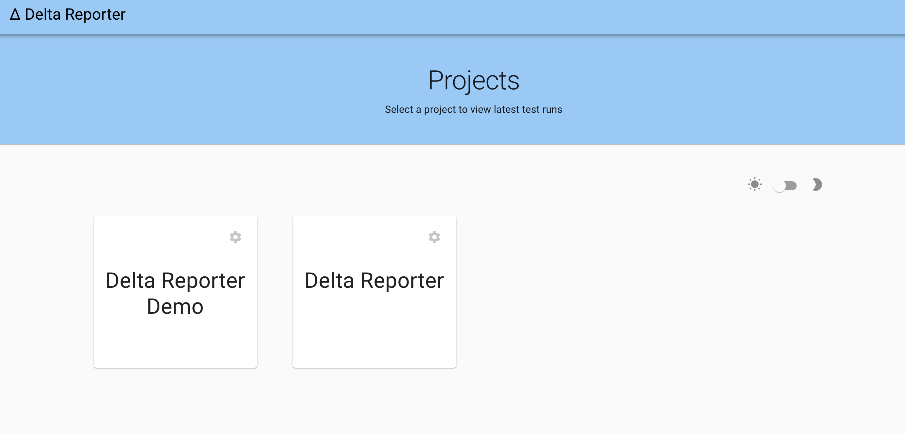
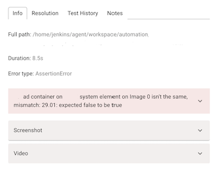
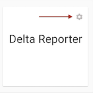

# Report structure and main features

Delta Reporter tool has some great features available to you, please read the following guide if you want to know more!

## Structure Overview

There are few main components that form the report, it's quite intuitive and easy to understand and follow.

#### Projects

Main page of the tool is the projects page. 
This page contains all the different projects your teams are working on, so that tests are nicely structured and easy to find.

#### Launches

After the project is selected, user is navigated to Launches page. 
This page contains all the test runs. Say, there was a release, and some UI tests were triggered by CI job. 
There will be a new launch created with your UI tests available there.

If then you run some API tests locally, you will see another new line of launches, indicating it was a local launch. 

Great thing about delta, is that every element on the page can be configured and is not static. 

#### Suites

After user selects a test run he wants to view, he is brought to the final page - suites and tests. 
Here is how it looks at the first glance: there is an expandable list of suites.

When a test is selected, a new view appears on the right. This view contains all the necessary information about your test in one place: logs, screenshots, test history and resolution.

## Test features

- Info section

Info section contains the most important information about your failed test. You can check out the error, duration, screenshot and video of the test failing!

- Resolution section
This is a handy tool to put a resolution badge on your tests. So that next time you view test results, you can quickly identify what's the issue without even checking the error message.
Also it's useful, when you check same test results with your colleagues, so they know you've already identified the issue.

- Test History section

This tab contains historical information about this test: status, date, resolution if amy.

- flaky badge
- filtering
- realtime updates
- media

## Useful Links

You can create custom links on Delta Reporter, which can be really useful to integrate other tools like logs from the system under test (like Kibana), a link back to the CI/CD job that started the test run (like Jenkins, Azure Pipelines, Travis), bug management tools (like Bugzilla, JIRA), or any external application.

In order to create a useful link, first go to your project options:

This will open a modal window where you can create your useful links for the project selected

The useful links could be displayed in two places: Test Run view or Test View

Besides selecting a location for the new link, you can also set a regular expression, so that the link will only be displayed in the environment that matched it, so feel free to set different link for different testing environments

Its possible to enrich a link with data from Delta Reporter, this way you could send ids, timestamps, and other data to other systems with just one click

The availability of the fields you can pass into it will depend on the location:

### Test Run

    id
    start_datetime
    test_type
    test_run_status_id
    launch_id
    end_datetime
    environment

### Test

    id
    retries
    test_suite_history_id
    start_datetime
    end_datetime
    mother_test_id
    message
    test_status_id
    error_type
    test_resolution_id
    test_run_id

Its also possible to send custom data back to Delta, please check the plugin for your framework for details

### Useful links examples

Based on the screenshot above, we can 4 links with the following usage:

- Dark Blue: Link to a Jenkins Job that launches the tests, the link uses custom data sent by the client plugin, in this case the value for the link is `{jenkins_url}`
- Dark Green: Link to a external tool for Visual Regression testing, the link uses custom data sent the client plugin, in this case the value for the link is `{spectre_test_run_url}?status=fail`
- Magenta: Link an external tool to create a bug related to this failed tests, the link uses the test id in order to have a back reference, in this case the value for the link is `<tool_url>?test={id}`
- Clear Green: Link to Kibana to access logs for the system under test, the link uses the time in the test to filter the logs in the range were the test was running, in this case the value for the link is `<kibana_url>/discover?_g=(time:(from:'{start_datetime}',mode:absolute,to:'{end_datetime}'))`
